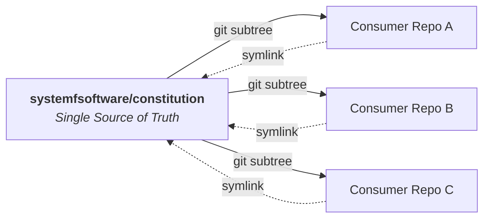

# Constitution

[](LICENSE)
[](https://systemfsoftware.com/constitution)
[](CONSTITUTION.md)

> **Constitution is the single source of design law for repositories under [System F Software](https://systemfsoftware.com).**

It binds every project to a pure functional core behind a thin imperative shell, types before logic, the Testing Trophy, and subtraction over addition. It is strictly **stack-neutral** — principles, not frameworks — so it governs any codebase in any language.



---

## The Two-Document Architecture

The constitution is partitioned by **attention lifecycle**. Residency is paid on every turn of every agent run; retrieve what the work announces, keep resident only what nothing catches.

```
constitution/
├── CONSTITUTION.md             # [Always-on] Resident in every agent's context
└── CONSTITUTION-ARTICLES.md    # [On-demand] Retrieved only on source write/edit
```

| Document | Lifecycle | Contents | How to wire in your harness |
| :--- | :--- | :--- | :--- |
| **`CONSTITUTION.md`** | **Always on** | Preamble, Application (invocation & enforcement gates), Article V (Conduct) | Load into context every turn: `@CONSTITUTION.md` in `AGENTS.md` / `CLAUDE.md` |
| **`CONSTITUTION-ARTICLES.md`** | **On demand** | Articles I–IV (Pure Core, Boundary, Verification, Organization) | Path-scoped rule triggered on **write/edit** of a source file (never on read) |

> **Why the split?** A rule whose harm fires before you would know to look it up (*e.g.* concealing a bypass or shrinking scope) must be resident. Craft laws (*e.g.* pure domain models or test layers) fire when the artifact is in front of you. Making craft laws resident wastes context tokens; making governance retrievable lets rules quietly slip.

---

## Quick Start (30-Second Subtree Setup)

Vendor the constitution into your repository as a squashed subtree and symlink both documents to your root:

```bash
# 1. Fetch into a named ref (avoids transient FETCH_HEAD tracking issues)
git fetch https://github.com/systemfsoftware/constitution.git main:refs/remotes/vendor/constitution

# 2. Vendor as a squashed subtree
git subtree add --prefix=vendor/constitution refs/remotes/vendor/constitution --squash \
  -m "chore: vendor shared constitution"

# 3. Symlink both documents to the repo root
ln -s vendor/constitution/CONSTITUTION.md CONSTITUTION.md
ln -s vendor/constitution/CONSTITUTION-ARTICLES.md CONSTITUTION-ARTICLES.md
```

*(Note: Brand-new repositories must have at least one commit prior to running `git subtree add` — run `git commit --allow-empty -m "init"` first if needed).*

### Wire into your agent harness

1. Add `@CONSTITUTION.md` to your root `AGENTS.md` or `CLAUDE.md`.
2. Configure a tool hook or path-scoped rule (`.claude/rules/` / `.cursor/rules/`) to deliver `CONSTITUTION-ARTICLES.md` when editing source files.

---

## The Articles

| Article | Location | Enforcement | Axioms |
| :--- | :--- | :--- | :--- |
| **I — The Pure Core** | `CONSTITUTION-ARTICLES.md` | Retrieved | Decisions are pure; types come first; errors are tagged variants; `null` is not a state; single code path. |
| **II — The Boundary** | `CONSTITUTION-ARTICLES.md` | Retrieved | Functional core / imperative shell; effects are values; decode at the boundary, never cast; dependencies point inward. |
| **III — Verification** | `CONSTITUTION-ARTICLES.md` | Retrieved | The Testing Trophy; properties over example tests; mutation score is the measure of test suite quality. |
| **IV — Organization** | `CONSTITUTION-ARTICLES.md` | Retrieved | Organized by domain responsibility, not technical layer; names scream intent; modules fit in human memory. |
| **V — Conduct** | `CONSTITUTION.md` | **Always on** | Fix root causes (depth over expedience); challenge before committing; subtract lines before adding. |

---

## Updating a Consumer

When an amendment lands in the upstream constitution, pull updates with zero symlink changes:

```bash
git subtree pull --prefix=vendor/constitution https://github.com/systemfsoftware/constitution.git main --squash \
  -m "chore: update shared constitution"
```

---

## Machine Enforcement & Validation

Every rule in both documents is machine-readable YAML:

```yaml
- id: CONST-S4
  title: Subtract Before You Add
  gate: review
  do: treat every line as a liability — removal is the default response to slop
  dont: extend a copy-paste cluster; patch around a rotten core
  harm: the codebase only grows; rot survives every patch and regrows
  check: review reads the net line delta; fixes that leave root violations are rejected
```

The repository suite verifies rule uniqueness, schema conformity, citation resolution, and family assignments across both files as a unified corpus:

```bash
pnpm test
```

---

## Contributing

Amendments require a written rationale, a version bump, and an update to consuming harnesses. See [AGENTS.md](AGENTS.md) for development rules, commit conventions, and test commands.

## License

[Apache-2.0](LICENSE) © 2026 Ryan Lee.
