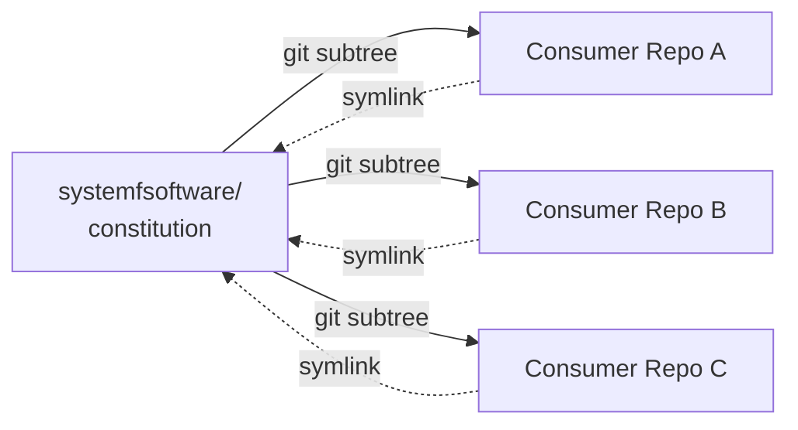

# Constitution

[](LICENSE)
[](https://systemfsoftware.com/constitution)
[](CONSTITUTION.md)

> **Constitution is the design law for teams who want unbreakable code without tools lock-in.**

It binds every repository under [System F Software](https://systemfsoftware.com): a pure functional core behind a thin imperative shell, types before logic, the Testing Trophy, and removal over addition. It is **stack-neutral** — principles, not frameworks — so it governs any codebase, in any language.



One source of truth. Every consumer vendored. Zero drift.

```bash
# brand-new repo? commit once first: git commit --allow-empty -m "init"
git fetch https://github.com/systemfsoftware/constitution.git main:refs/remotes/vendor/constitution
git subtree add --prefix=vendor/constitution refs/remotes/vendor/constitution --squash -m "chore: vendor shared constitution"
ln -s vendor/constitution/CONSTITUTION.md CONSTITUTION.md
ln -s vendor/constitution/CONSTITUTION-ARTICLES.md CONSTITUTION-ARTICLES.md
```

## Which file is which

The two documents have **opposite lifecycles**. Point each at its harness the right way, or the law does not hold:

| File | Lifecycle in a consumer repo | How the harness loads it |
| --- | --- | --- |
| **`CONSTITUTION.md`** | **Always on** — resident in every agent's context, on every run | `@CONSTITUTION.md` referenced from `AGENTS.md` / `CLAUDE.md` |
| **`CONSTITUTION-ARTICLES.md`** | **On demand** — Articles I–IV, fetched only when a source file is written or edited | a path-scoped rule on **write/edit**, never on read, never always-on |

The first file is the law of governance and work: how a principle is invoked, enforced, and grounded (the Preamble and Application block), plus Article V — Conduct. Nothing announces it and no mechanism catches it, so it has to be in context already. The second file is the craft law: Articles I–IV fire on the artifact they govern, when the work actually reaches it — deliver it at that moment, not on a read. Rendering it resident would tax every turn of every unrelated task; delaying the first file to retrieval lets a rule slip that should have held.

## The Problem

Design principles live in CONTRIBUTING.md, ARCHITECTURE.md, PR comments, Slack threads, the senior engineer's head. None of those propagate. A new repo starts from a blank page; an old repo inherits yesterday's opinions; a reviewer enforces a rule nobody else has read. By the fifth service, the codebase has five different architectures and five different definitions of "done."

## The Solution

The law ships as two documents with opposite lifecycles — the mapping in ["Which file is which"](#which-file-is-which) is the short version. [`CONSTITUTION.md`](CONSTITUTION.md) is **always-on** — it goes into every agent's context and stays there, and it carries only what nothing announces and no mechanism catches: the Preamble, the Application block (how a rule is invoked and enforced), and Article V (Conduct). [`CONSTITUTION-ARTICLES.md`](CONSTITUTION-ARTICLES.md) is **on-demand** — Articles I–IV, the craft law, delivered when the work reaches the artifact each one governs. Every repo under System F Software vendors both via `git subtree` and references them via symlink. **Amend one here, and every consumer picks up the new law on its next subtree pull.** No forks. No copies. No drift.

The split is not filing. A rule whose harm fires before you would know to look it up has to be resident or it does not hold; a rule the work itself announces costs every unrelated task attention it never needed. Residency is bought with every token of every turn, so it is spent only where retrieval cannot reach.

Stack neutrality is the load-bearing constraint: principles stay at the level of *"a state machine hidden in a record"* and *"mutation is the measure,"* not *"use this ESLint rule"* or *"this ORM."* Tools change every year; the laws do not.

## Quick Start

Vendor the constitution into your repository as a squashed subtree, then symlink it to the repo root:

```bash
# 0. A brand-new repo needs one commit before the subtree add
git commit --allow-empty -m "init"

# 1. Fetch into a named ref — a transient FETCH_HEAD silently breaks subtree tracking
git fetch https://github.com/systemfsoftware/constitution.git main:refs/remotes/vendor/constitution

# 2. Vendor it as a squashed subtree
git subtree add --prefix=vendor/constitution refs/remotes/vendor/constitution --squash \
  -m "chore: vendor shared constitution"

# 3. Symlink both to the repo root
ln -s vendor/constitution/CONSTITUTION.md CONSTITUTION.md
ln -s vendor/constitution/CONSTITUTION-ARTICLES.md CONSTITUTION-ARTICLES.md
```

Reference the resident half from your agent harness (`AGENTS.md` or `CLAUDE.md`) so it is in context on every run:

```markdown
@CONSTITUTION.md
```

Do **not** reference the articles the same way — that would make them resident and defeat the split. Deliver them on **write or edit** of a source file, never on read: an agent that greps, or works from a plan, never fires a read trigger. The trigger condition is the law's; the mechanism is your harness's — a path-scoped rule (`.claude/rules/*.md` with `paths:`), a pre-tool gate, or whatever your tooling exposes. Wire it in your own `AGENTS.md`, and if your harness has no such mechanism, say so there and fall back to a named situational read.

You should see both files tracked under `vendor/constitution/`, both symlinked at the repo root, and `git subtree pull` ready to refresh them.

## Update a Consumer

```bash
git subtree pull --prefix=vendor/constitution https://github.com/systemfsoftware/constitution.git main --squash \
  -m "chore: update constitution"
```

The symlinks never change — they always point into `vendor/constitution/`, so a pull just refreshes the content underneath.

## Articles

| Article | File | In context | Principle |
| --- | --- | --- | --- |
| **I — The Pure Core** | `CONSTITUTION-ARTICLES.md` | on write/edit | Decisions are pure; types come first; errors are variants; null is not a state; one path. |
| **II — The Boundary** | `CONSTITUTION-ARTICLES.md` | on write/edit | Functional core / imperative shell; effects are values; decode never cast; dependencies point inward. |
| **III — Verification** | `CONSTITUTION-ARTICLES.md` | on write/edit | The Testing Trophy; properties over examples; mutation is the measure. |
| **IV — Organization** | `CONSTITUTION-ARTICLES.md` | on write/edit | Organized by what it does; names scream the domain; fits in the head. |
| **V — Conduct** | `CONSTITUTION.md` | **always on** | Depth over expedience; challenge before you commit; subtract before you add. |

The Preamble and the Application block — how to read a rule, and how a principle is invoked, enforced, and resolved against another document — live in `CONSTITUTION.md` alongside Article V, always on.

Each rule is a YAML block with `do`, `dont`, `harm`, `check`, and `gate` — machine-readable, agent-discoverable, and ready for property tests over the corpus. `pnpm test` validates both files as one corpus: ids are unique across it, citations resolve across it, and a file that exists but declares no rule fails rather than scoring like a whole one. A rule dropped in a move fails while any citation to it survives; when nothing cites it, `pnpm test --against <rev>` names the vacated id on the success line instead, because failing every legitimate deletion would be worse than reporting one.

## Amendment

The constitution is amendable by design. An amendment carries a written rationale, a version bump, a date, and a matching update to the consuming `AGENTS.md`. Proposed additions go through challenge first (`CONST-W2`) — every rule must name the harm it prevents, and removal is the default response to slop at every scale (`CONST-S4`).

## FAQ

**Q: Why two files instead of one?**
A: Because residency is not free. Every line of a resident document is paid on every turn of every agent in every consumer repo, whether or not the work touches it — and measured degradation from input length holds even when the model retrieves perfectly and the irrelevant tokens are masked out (Du et al., [arXiv 2510.05381](https://arxiv.org/abs/2510.05381)). Articles I–IV govern artifacts the work puts in front of you, and most of them are backed by a lint, type, or mutation gate; they can be fetched at the moment they apply. The Preamble, the Application block, and Article V cannot: nothing announces them, no mechanism catches them, and an agent about to conceal a bypass does not go looking for the rule against it. Those stay resident. Both halves are one corpus to `pnpm test`.

**Q: Why git subtree + symlink instead of a git submodule?**
A: Submodules pin a commit and surface a detached `HEAD` to anyone cloning — bad for a document every contributor reads on day one. A subtree is just files, and the symlink makes the path stable so `AGENTS.md` can reference `@CONSTITUTION.md` once and never change.

**Q: Why not pin CONSTITUTION.md to a specific version per consumer?**
A: Drift. The whole point of one source of truth is that an amendment here propagates everywhere on the next pull. Pinning would reintroduce the fork-by-copy problem the constitution exists to solve.

**Q: Can a consumer override a rule?**
A: No — that is what an amendment is for. Override-by-fork has been the failure mode for every prior attempt at a shared design law.

**Q: How do I cite a rule in a PR?**
A: By the harm it prevents, not by clause number. `CONST-G1`: *"invoke a principle by showing the harm is present."* Ids are stable for cross-document reference and the prose around them can change — the family letter says what the rule is about (`CONST-B3` is a boundary rule), never which article it sits in.

**Q: `git subtree add` fails with "ambiguous argument 'HEAD'".**
A: The subtree command needs an existing commit. In a brand-new repo, run `git commit --allow-empty -m "init"` first, then re-run the add.

**Q: Is this only for TypeScript / Effect / a specific stack?**
A: No. The principles are stack-neutral. The harness that enforces them (`AGENTS.md`, lint rules, property tests) lives in each consumer repo and is free to vary by stack.

## Support

Questions, bug reports, and amendment proposals: [issue tracker](https://github.com/systemfsoftware/constitution/issues).

## Contributing

Development workflow, commit conventions, and verification commands: [AGENTS.md](AGENTS.md). This repository has no production code and no build step — the deliverable is the document itself.

## License

[Apache-2.0](LICENSE) © 2026 Ryan Lee.
